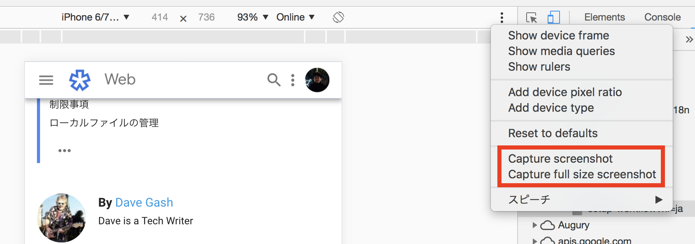

# Chrome

## 概要

Webサイト制作に最も適したブラウザです。拡張機能を追加することで、開発を効率化したり、開発者ツールでサイトの検証を行うことができます。

{% embed data="{\"url\":\"https://www.google.com/chrome/\",\"type\":\"link\",\"title\":\"Chrome Web Browser\",\"description\":\"Google Chrome is a fast, secure, and free web browser, built for the modern web. Give it a try on your desktop today.\",\"icon\":{\"type\":\"icon\",\"url\":\"https://www.google.com/chrome/static/images/favicons/android-icon-192x192.png\",\"width\":192,\"height\":192,\"aspectRatio\":1},\"thumbnail\":{\"type\":\"thumbnail\",\"url\":\"https://www.google.com/chrome/static/images/chrome-logo.svg\",\"aspectRatio\":0}}" %}

## JSのデバッグ

{% embed data="{\"url\":\"https://ics.media/entry/11735\",\"type\":\"link\",\"title\":\"ChromeのデベロッパーツールでJSをデバッグする方法\(2018年版\) - ICS MEDIA\",\"description\":\"JavaScriptのデバッグは必ず覚えておきたいWeb開発の必須スキルの一つです。プログラムの実行をデバッグすることで現在の変数の値や、処理がどのように進んでいるのかを確認します。これを利用してプログラムが意図した動作 …\",\"icon\":{\"type\":\"icon\",\"url\":\"https://ics.media/wp-content/themes/icslab/img/apple-touch-icon.png\",\"aspectRatio\":0},\"thumbnail\":{\"type\":\"thumbnail\",\"url\":\"https://ics.media/wp-content/uploads/2016/05/160513\_chrome\_debug\_eyecatch.jpg\",\"width\":1280,\"height\":512,\"aspectRatio\":0.4}}" %}

## エミュレート

ワイドモニタ、スマートフォンの表示チェックができます。エミュレータは絶対ではないので、最終的には**必ず実機で**動作確認を行いましょう。

{% embed data="{\"url\":\"http://www.atmarkit.co.jp/ait/articles/1403/20/news050.html\",\"type\":\"link\",\"title\":\"Google Chromeブラウザでスマートフォンサイトをチェックする\",\"description\":\"Webサイトのスマートフォン表示の確認は結構面倒な作業です。でもGoogle Chromeのデベロッパーツールでエミュレートすれば、デストップ版ブラウザでスマートフォンサイトを簡単に表示できます。\",\"icon\":{\"type\":\"icon\",\"url\":\"http://www.atmarkit.co.jp/favicon.ico\",\"aspectRatio\":0},\"thumbnail\":{\"type\":\"thumbnail\",\"url\":\"http://image.itmedia.co.jp/ait/articles/1403/20/cover\_news050.png\",\"width\":590,\"height\":539,\"aspectRatio\":0.9135593220338983}}" %}

### スクリーンショット

エミュレート状態から、サイトのスクリーンショットが取得できます。修正指示やバグの共有に利用しましょう。

## 拡張機能

### Google 翻訳

最新情報やバグ情報が英文ドキュメントであることはよくあります。翻訳拡張機能があれば、すぐに翻訳することができます。

{% embed data="{\"url\":\"https://chrome.google.com/webstore/detail/google-translate/aapbdbdomjkkjkaonfhkkikfgjllcleb\",\"type\":\"link\",\"title\":\"Google Translate\",\"description\":\"View translations easily as you browse the web. By the Google Translate team.\",\"icon\":{\"type\":\"icon\",\"url\":\"https://ssl.gstatic.com/chrome/webstore/images/icon\_144px.png\",\"width\":144,\"height\":144,\"aspectRatio\":1},\"thumbnail\":{\"type\":\"thumbnail\",\"url\":\"https://lh3.googleusercontent.com/iaysb2R0atkr6DbSAhdN4bStgkYqm3F9rNaCLc3DxKoxvUYTKe4XynKGgiPqtlatTdreiFLMUw=w128-h128-e365\",\"width\":128,\"height\":128,\"aspectRatio\":1}}" %}

### Lighthouse

Lighthouseを使うことで、Web サイトのパフォーマンスやアクセシビリティをチェックすることができます。

{% embed data="{\"url\":\"https://chrome.google.com/webstore/detail/lighthouse/blipmdconlkpinefehnmjammfjpmpbjk\",\"type\":\"link\",\"title\":\"Lighthouse\",\"icon\":{\"type\":\"icon\",\"url\":\"https://ssl.gstatic.com/chrome/webstore/images/icon\_144px.png\",\"width\":144,\"height\":144,\"aspectRatio\":1},\"thumbnail\":{\"type\":\"thumbnail\",\"url\":\"https://lh3.googleusercontent.com/S5e-d-Kt9iLTVaY1AIza9qqVrbtc0f5RD4WD-1RRToS9WbVjaFyCWzENQ4j\_PsWLwv4m3YHC8us=s128-h128-e365\",\"width\":128,\"height\":128,\"aspectRatio\":1}}" %}

