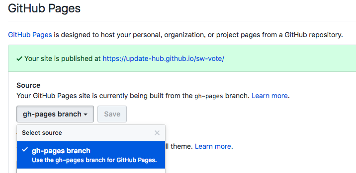

# Git

## 公式サイト





### リポジトリサービス

* [GitHub](https://github.com) - 世界的メインストリーム。プライベートリポジトリは有料。
* [GitLab](https://about.gitlab.com/) - 国内の現場で採用率高。プライベートリポジトリも無料。
* [BitBucket](https://bitbucket.org/product) - プライベートリポジトリも無料（制限あり）

## クイックスタート

### 基本的な流れ

既存のGitプロジェクトを自分のPCに複製する

```bash
$ git clone http://.....
```

ブランチを作成する\(new-branch という名前のブランチを作成する例）

```bash
$ git branch new-branch
```

 ブランチを切り替える

```bash
$ git checkout new-branch
```

作業内容をコミットする

```bash
$ git add .
$ git commit -m '<コミットメッセージ>'
```

issueに紐づく作業の場合、コミットメッセージの最後にissue番号を記載しましょう

```bash
$ git commit -m 'リンク先を修正 #23' // #23 のissueに紐づく作業の場合
```

作業内容をPushする

```bash
$ git push
```

他の人の作業を取り込む

```bash
$ git pull
```

## リファレンス

### 特定のコミットを取り消したい

```bash
$ git log // 作業ログの確認（取り消したいコミットのコミットIDを控える）
$ git revert <コミットID> // コミットメッセージを聞かれるので適宜編集して保存
```

### 直前のコミットに現状の作業を追加したい


amendを行った場合 Force Push（強制Push）が必要になります。


```bash
$ git commit -a --amend // コミットメッセージを聞かれるので適宜編集して保存
```

### 現在の作業内容を確認したい

```bash
$ git diff
```

### 現在の編集されているファイル群を確認したい

```bash
$ git status
```

## Gitクライアント

Gitクライアントを使うとコマンドを使わなくても直感的にGitの基本操作を行うことができます。

* [Visual Studio Code](https://code.visualstudio.com/docs/editor/versioncontrol)
* [GitHub for Desktop](https://desktop.github.com/)
* [SourceTree](https://www.sourcetreeapp.com/)

## Tips

### Git管理のポイント

* 作業はこまめにコミットしましょう。
* コミットメッセージは作業内容が端的に一目で分かるようにしましょう。
* issueに紐づく作業の場合はコメントの後ろに `作業内容 #4` などとissue番号を追記しましょう。
* 作業単位\(issue単位\)でbranchを切りましょう。

### ブランチモデル

Git Flowがメジャーですが、毎日DeployするようなハイサイクルなプロジェクトではGitHub Flowが推奨されます。

#### GitHub Flow

[https://gist.github.com/Gab-km/3705015](https://gist.github.com/Gab-km/3705015)

ハイサイクルなプロジェクト向け。マイナーだがシンプル

* master = 公開できる状態として保守
* 作業単位でブランチを作成し、Pull Request を通して master を更新

#### Git Flow

ローサイクルなプロジェクト向け。メジャーだが複雑。

[https://danielkummer.github.io/git-flow-cheatsheet/index.ja\_JP.html](https://danielkummer.github.io/git-flow-cheatsheet/index.ja_JP.html) [https://github.com/nvie/gitflow](https://github.com/nvie/gitflow)

### マージ時にコンフリクトした場合

プルリクエストをマージする際にコンフリクトが発生した場合は、以下のようにして対応します。（決してmasterブランチを直接いじろうとしないこと）

1. PR対象のブランチ\(最新の状態\)を作業ブランチに取り込む\(merge XXX\)
2.  コンフリクトを解消する
3.  作業ブランチを再度Pushする
4.  コンフリクトが消えており、PRが通る状態になっている

1.の時点でコンフリクトが出ているはずなので、エディターでプロジェクト内を &gt;&gt;&gt; で一括検索すると競合箇所が分かります。Visual Studio Codeには競合の解決機能がついているので、それでmasterか自分のブランチか正しい方（あるいは両方）を取り込み、コンフリクトを解消してから3.に進みます。

### SlackとGitHub連携

SlackとGitHub連携を行うことでGitHubのアクティビティをSlackのチャンネルで知ることができます。チーム開発においてほぼ必須の連携です。

SlackとGitHubを連携させる（Updateは既に連携済みなので不要です）

{% embed data="{\"url\":\"https://get.slack.help/hc/ja/articles/232289568-GitHub-と-Slack-を連携させる\",\"type\":\"link\",\"title\":\"GitHub と Slack を連携させる\",\"description\":\"GitHub は、ソフトウェア開発者のチームが共同でコードを記述し、プロジェクトを管理するためのツールです。GitHub を Slack に連携させれば、選択した Slack チャンネルであらゆるイベントの通知を受信できるようになります。一番よく使う重要度の高い2つのツールを連携させて、業務の状況を Slack 内から完全に把握できるようにしましょう。🛠  用途に合わせてアプリを選択   S...\",\"icon\":{\"type\":\"icon\",\"url\":\"https://p4.zdassets.com/hc/settings\_assets/138842/200037786/vM8rHxxVKCakJZaTPOZ81Q-favicon.png\",\"aspectRatio\":0},\"thumbnail\":{\"type\":\"thumbnail\",\"url\":\"https://p4.zdassets.com/hc/settings\_assets/138842/200037786/yhcUITDtg0nMfANzyrWvIA-help-center-unfurl-image.png\",\"width\":192,\"height\":192,\"aspectRatio\":1}}" %}

関連チャンネルで下記のコマンドを打つ

```
/github subscribe <リポジトリURL or リポジトリパス> reviews comments branches
```

### GitHub Pages で公開する

gh-pages をグローバルにインストール

```bash
$ npm install -g gh-pages
```

プロジェクトディレクトリに移動し、公開コマンドを叩く

```bash
$ gh-pages -d <Deploy Directory>
```

GitHubのリポジトリページでGitHub Pagesを有効にし、対象ブランチを `gh-pages` ブランチにする。しばらく待つか、設定後に再度何かしらの deploy を行うことで見れるようになります。




GitHub Pages で公開されるページは第二階層目になるため、リンク先、ソース指定をルート相対（/hoge\)ではじめていたらリンク切れとなります。GitHub Pages で公開する場合は必ず相対パス\(./hoge\)指定を行いましょう。


