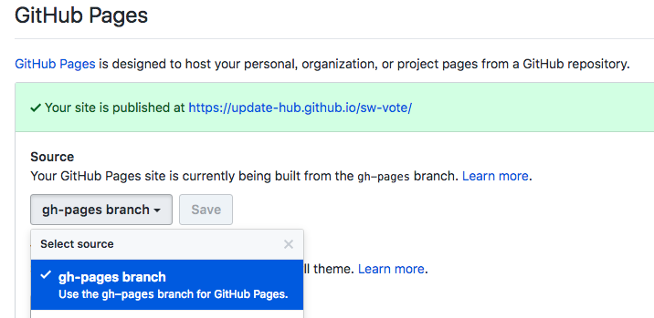

# React

## 公式ドキュメント



{% embed data="{\"url\":\"https://reacttraining.com/react-router/\",\"type\":\"link\",\"title\":\"React Router: Declarative Routing for React\",\"description\":\"Learn once, Route Anywhere\",\"icon\":{\"type\":\"icon\",\"url\":\"https://reacttraining.com/react-router/apple-touch-icon.png\",\"width\":180,\"height\":180,\"aspectRatio\":1},\"thumbnail\":{\"type\":\"thumbnail\",\"url\":\"https://reacttraining.com/react-router/react-square.png\",\"width\":562,\"height\":562,\"aspectRatio\":1},\"caption\":\"React Router\"}" %}

{% embed data="{\"url\":\"https://redux.js.org/\",\"type\":\"link\",\"title\":\"Read Me - Redux\",\"icon\":{\"type\":\"icon\",\"url\":\"https://blobscdn.gitbook.com/v0/b/gitbook-28427.appspot.com/o/spaces%2F-L5K1I1WsuQMZ8ecEuWg%2Favatar.png?generation=1518623866348435&alt=media\",\"aspectRatio\":0},\"caption\":\"Redux\"}" %}

## クイックスタート


事前に[Yarn](https://yarnpkg.com/lang/ja/)のインストールを行ってください。


React Create App の導入（まだの場合）

```bash
$ npm install -g create-react-app
```

Reactアプリを作成

```bash
$ create-react-app <アプリ名>
$ cd <アプリ名>
```

Redux, Router を導入

```bash
$ yarn add redux react-redux react-router-dom
```

ESLintを導入\(オプション）



```javascript
{
    "parserOptions": {
        "ecmaVersion": 6,
        "sourceType": "module",
        "ecmaFeatures": {
            "jsx": true
        }
    },
    "rules": {
        "semi": [2, "always"]
    }
}
```



開発スタート

```text
$ yarn start
```

srcディレクトリ内に以下のディレクトリを作成してください。

| ディレクトリ名 | 役割 |
| :--- | :--- |
| reducers | reducer を格納\(redux\) |
| actions | reducer を格納\(redux\) |
| containers | container をラップし、actions, reducers と接続\(redux\) |
| components | ページやユニークなコンポーネントを格納 |
| components/ui | 見出し、カードなど再利用可能なコンポーネントを格納 |

###  Example



## Tips

### GitHub Pages に公開

gh-pages をプロジェクトに追加

```bash
$ yarn add -D gh-pages
```

package.json に3箇所記述を追加



```javascript
"private": true
"homepage": "GitHub Pages のURL", // ← 追加

~
"scripts": {
...
"predeploy": "npm run build", // ← 追加
"deploy": "gh-pages -d build" // ← 追加
}
```



deploy実行

```bash
$ yarn run deploy
```

GitHub Pagesの設定画面でブランチを gh-pages に設定します。



しばらく待つか、設定後に再度何かしらの deploy を行うことで見れるようになります。

