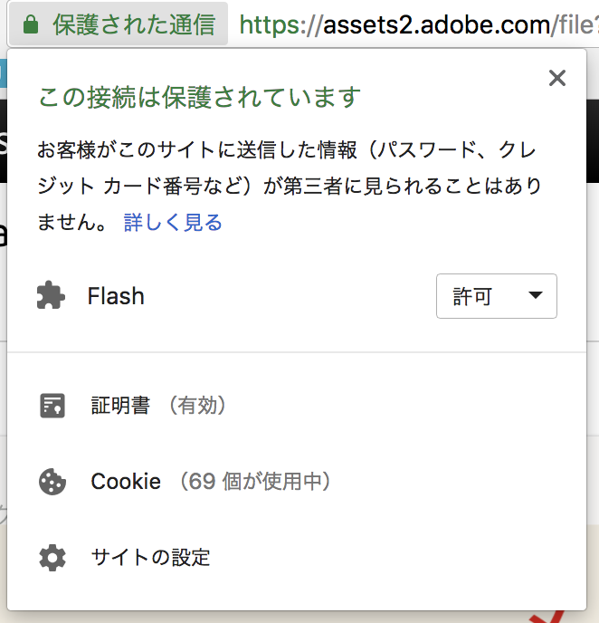
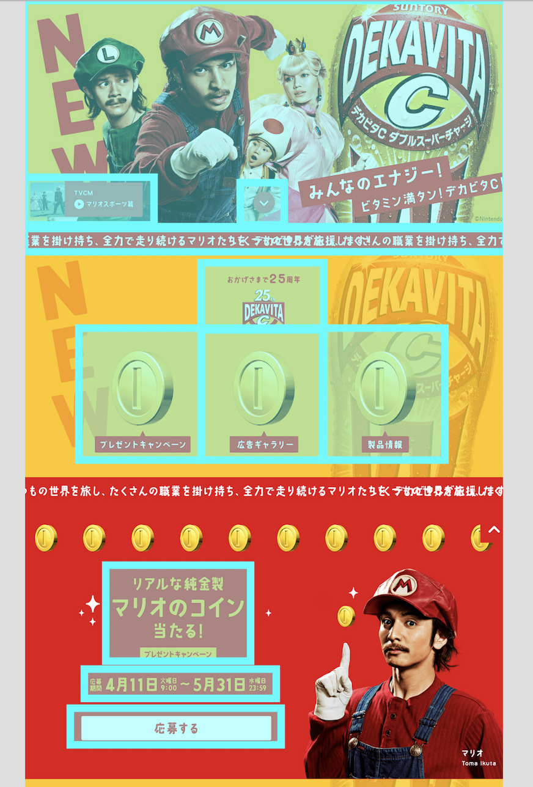

# PhotoShop

## 概要

Webデザイナーの多くはPhotoshopでPSDファイルを作成し、コーダーに共有します。コーダーはPSDを開いて文字色やフォントサイズ、余白、画像の切り出しを行うことで、Webサイトを構築していきます。

PhotoShopは有料で、企業に入る場合は企業側で用意されていますが、自宅でフリーランスをやる場合はサブスクリプションに加入する必要があります。（フォトプランで980円/月）

## デザインデータの抽出

PSDからコーディングに必要なデザインデータを取得する場合、Adobe Extract を使えば直感的に余白や文字サイズを抽出を行うことができます。文字などのコピー機能が使えない場合、サイトの設定からFlashを許可してください。



Adobe Extract での抽出がうまく行かない場合、PhotoShopでpsdを開いて、情報を取得することとなります。



### 抽出対象の判断

SEO、ユーザービリティなどあらゆる観点から、可能な限りWebサイトはテキストベースであるべきです。コーディングが複雑になるからといって、多くの要素をまとめて画像にして添付するような実装は行いません。その際、どこを画像として実装し、どこをテキストとして実装するか迷うこともあるかもしれません。

基本的に、PhotoShop上でWebフォントかOS標準フォントが使われていたら、そこはデバイスフォント（つまり画像ではない）で組むべきです。特殊なフォントが使われており、Webフォントで表現が難しい部分は、画像として実装してください。

また、特にLPなどで派手な装飾、複雑な装飾がデザインとして上がってくることがあります。その辺りについては工数と相談しつつ、基本的には目的ごとに画像を分けて抽出し、実装します。工数や予算が少なく、またSEOもさほど重要ではないと判断された場合は、大きいくくりで画像を分けて実装します。RWD対応があるかどうかも判断材料としてください。

例えば下記のデザインの場合、以下の粒度が一つのパターンとして考えられます。リンクできる要素は当然画像を分けるのですが、そうでない場合も、「見出し」や「本文」といった意味のあるまとまりで画像を分離するのが理想的です。

### コーダーとしての心構え

デザイナーもコーダーも、いいサイトを作るという共通の目的を持っています。渡されたデザインに、明らかに見えずらい部分や、無意味なサイズ、色のブレがあった場合、デザイナーのミスである可能性を考慮し、デザイナーに確認するようにしましょう。

ただ渡されたデザインを何も考えずに組み立てるのではなく、コーダーとして、「このデザインは工数がかかるので、少しこう変えてもらうことは可能か？」などといった提案をすることも、時には必要です。

### ポイント

* 画像名に日本語が使われることはありません。既存ファイルがある場合、既存の画像命名規則に揃えましょう。新規案件の場合、ケバブケース\(item-1.png\)で命名しましょう。
* 画像はまとまりごとにディレクトリを分割して管理し、画像名も規則的な命名を意識しましょう。（button-1.png と btn-02.png などが混在しないようにする）

## デザインをする場合

業務の世界において、時にPSDでバナーやデザインを頼まれることもあります。その際は、コーダーとしての視点を活かして、「組みやすいデザイン」「分かりやすいレイヤー設計」を意識しましょう。





