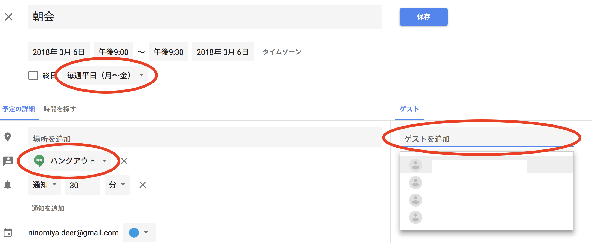
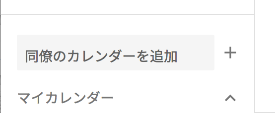

# パーティ

## 概要

リーダーはチームメンバーをまとめる必要があります。具体的には以下の役割を担います。

* チームビルディング
* 勤怠管理
* チームレポート提出

リーダーについてはスタッフが直接リーダー研修を行うので、スタッフにお声掛けください。

## チームビルディング

まずは以下の手順に沿ってチームビルディングを行ってください。

### 1. 自己紹介

まずはチームが円滑に進むよう、全員で自己紹介を行ってください。途中で新人が入った場合は改めて全員で自己紹介してください。基本的にこのチームで数ヶ月過ごすので、信頼関係を構築しましょう。

### 2. 朝会、夕会の設定

下記の予定をそれぞれ作成し、各メンバーを招待してください。それぞれ繰り返し予定として設定すると一括で登録可能です。予定作成時はハングアウトを有効にしてください。

朝会: 毎週平日の朝 9:00-9:30  
夕会: 毎週平日の夕 17:30-18:00

以後毎日この時間に朝会と夕会を**Google Hangout の通話**で実施してください。各予定のリンクからハングアウトに参加できます。

朝会 - 各自今日やることを報告してもらってください。  
夕会 - 各自今日やったことを報告してもらってください。  
  
いずれも記録は不要です。詰まっている部分や困りごとがないかを合わせて確認し、メンバー全員がお互いの状況を把握できるようにしてください。

### 3. 稼働予定の登録

メンバー全員に稼働予定をGoogleカレンダーに登録してもらってください。基本的に**朝9:00-18:00（休憩1時間\)**が稼働シフトになります。私用やアルバイトの都合で通常稼働が困難な方は、正しく予定に反映するよう伝えてください。また、メンバー全員のカレンダーを追加してお互いに見える状態にしてください。

### 4. 稼働管理表の展開

リーダーがメンバーの稼働管理を行ってください。稼働管理表に以下のように記入してください。リーダーが遅刻した場合は他の人が代わりに記入してください。

* 稼働予定にも関わらず朝会に参加しなかった　→　遅刻
* 稼働予定にも関わらず朝会、夕会両方に参加しなかった　→　無断欠勤

以上でチームビルディングは完了です。

## チームレポート

毎週１回、ふりかえりの定期スケジュールを入れてください。時間や曜日はメンバーの稼働状況により調整してください。以後毎週必ずチームレポートを送信してください。

[チームレポート](https://goo.gl/forms/zSiwARgexmm7mb462)

