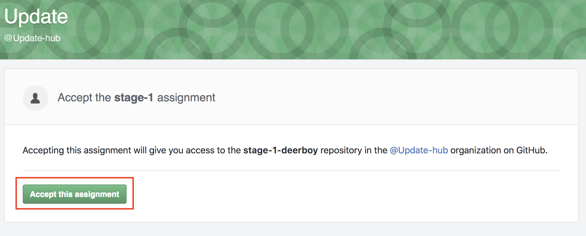
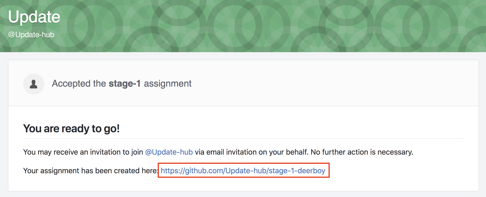

# チュートリアル

## 概要

* トレーニングは実務同様、Slackでコミュニケーションをとり、GitHubを使ってソースコードを管理します。
* GitHub Classroom で課題を作成しているので、各ステージの課題URLより課題をcloneしてから開発を行ってください。
* すべてのステージがクリアできたらプロテストを受け、合格するとUpdate Work に参加できます。

## 課題の作成方法



| Step | Image |
| --- | --- |
| 1.各課題のURLにアクセスし、緑のボタンをクリックします。 |  |
| 2.URLをクリックして自分のリポジトリに移動します。 |  |



ready...



